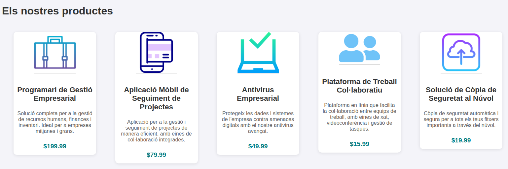

# Convocatòria Ordinària LMI

Ens trobem amb la web d'una empresa que ofereix diferents productes informàtics.

La web té tres seccions:

- Una secció d'inici, amb una benvinguda i una breu presentació.
- Una secció de productes, amb els productes que ofereix l'empresa.
- Una tercera secció amb un formulari de contacte ambel qual podem sol·licitar una demo dels productes.

Se us proporciona el codi de base, i la vostra tasca consistirà en completar aquest i documentar el procés amb Markdown i mkdocs.

El codi se us proporciona com una aplicació Express amb NodeJS. El fitxer `server.js` proporciona tot el backend necessari, i dins la carpeta `public` disposeu de tota la part del frontend.


## Exercici 0. Creació del projecte i la documentació en GitHub

Crea un projecte públic en GitHub, amb el nom "LMI_Convocatoria_Ordinaria", i afig en ell el contingut descomprimit que se us proporciona. És important que tingueu l'estructura proporcionada a l'arrel del projecte, no dins d'una carpeta.

En el projecte teniu, a més del codi font, un fitxer de configuració de mkdocs, i les carpetes `docsmd`, on anirà la documentació amb markdown, i `docs`, on anirà la documentació en format HTML, i que generareu amb un mkdocs build. El fitxer de configuració ja està configurat amb els paràmetres `docs_dir` i `site_dir` per apuntar a estes carpetes.

Una vegada tingueu el projecte en github, en la carpeta `docsmd`, anireu documentant els exercicis que realitzeu, indicant els fitxers que modifiqueu, els canvis que realitzeu en ells i una breu explicació del que esteu fent. Es tindrà en compte la generació d'un menú de navegació i el realitzar una pàgina per exercici.

Per a cada exercici, haureu de fer un *commit* i un *push* al repositori. El missatge del commit serà el nom de l'exercici que acabeu de fer.

## Exercici 1. Visualització de les pestanyes i el menú

Si s'adoneu, les tres seccions apareixen visibles, i els enllaços del menú es desplacen cap a la secció corresponent. Aquest no és el comportament que es busca. En lloc d'això, ha d'aparéixer només una secció, i les altres permanéixer ocultes. Inicialment, es mostrarà només la secció de benvinguda.

Completeu la funció `gestionaLinks()` per realitzar aquesta funcionalitat.

## Exercici 2. Creació d'un webComponent per als productes

Completa el fitxer `components/product-card.js` amb l'estructura de targeta per al webComponent que mostrarà els productes. La seua visualització serà semblant a la següent:



Tingueu en compte que només heu de definir un webComponent, i reutilitzar-lo per als diferents productes, no un webComponent per a cada producte, ja que aquests els obtindrem de manera dinàmica.

## Exercici 3. Càrrega de productes

Una vegada tingues definit el webComponent, carrega els productes des del servidor. Aquests els teniu disponibles en l'endpoint `/get-products`. Pots veure'n el JSON resultant amb una consulta a (http://localhost:3000/get-products).

Per a això, completa la funció `carregaProductes()` de l'script del client.

## Exercici 4. Incorpora els productes al formulari

Per tal de poder sol·licitar cita, a més de les dades del client, necessitem saber la data i el producte. Com que els productes es carreguen dinàmicament, caldrà generar de manera dinàmica el contingut d'aquest `select`.

Això ho pots fer en la mateixa funció `carregaProductes()`, de manera que cada vegada que generes un card, pots generar també l'opció del select.

## Exercici 5. Enviament del formulari

Completa la funció `preparaFormulari()` de l'script del client per agafar les dades del formulari i enviar-lo al servidor mitjançant una petició POST. L'endpoint que rebrà aquesta petició serà `/concertar-cita`. Una vegada enviades les dades, es generarà un PDF amb la confirmació. Haurem de crear un enllaç al document i forçar el clic per descarregar-lo.

## Exercici 6. Processament de la informació del formulari i generació del pdf.

El servidor processa la petició POST a l'endpoint `/concertar-cita` el middleware:

```js
app.post('/concertar-cita', async (req, res) => {...})
```

Aquest middlewara el teniu ja implementat, i el que fa és:

1. Recollir les dades del formulari
2. Generar un XML amb les dades (cita.xml)
3. Aplicar la transformació XSLT → XSL-FO
4. Generar el PDF a partir del XSL-FO (fent una crida a Apache FOP via child_process).
5. Enviar el pdf generat PDF com a resposta, perquè el descarregue.

La vostra tasca aci serà:

* Completar la funció `generarXML(dades)`, per a que genere l'XML corresponent a una cita. Aquest XML tindrà el següent format:

```xml
<cita>
  <client>
    <nom>Paco Pérez</nom>
    <email>paco@gmail.com</email>
    <telefon>5555555</telefon>
  </client>
  <producte>Programari de Gestió Empresarial</producte>
  <data>2025-12-31</data>
</cita>
```

* Completa la funció `transformarXSLT(xmlPath, foPath)`, de manera que feu ús de `xsltproc` per convertir l'xml definit en `xmlPath` en un XML en format XSL-FO en `foPath`. Disposeu de la plantilla (incompleta) en ./xslt/cita.xsl.

* Completa el fitxer `xslt/cita.xsl` amb ela paths necessaris per accedir a la informació proporcionada.

* Completa la funció `generarPDF(foPath, pdfPath)`, i incorpora l'ordre que utilitzaràs amb fop per convertir l'XML-FO a PDF.
